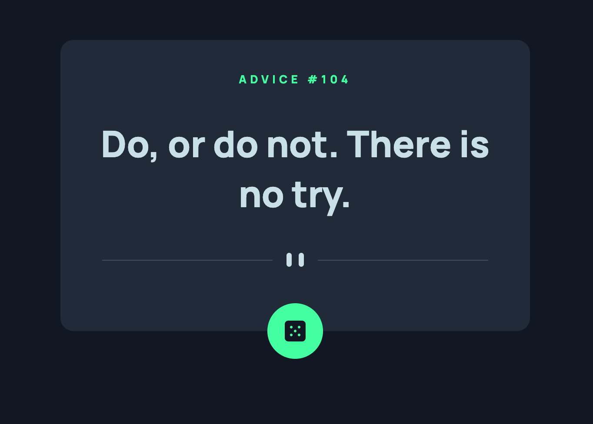

# Frontend Mentor - Advice generator app solution

This is a solution to the [Advice generator app challenge on Frontend Mentor](https://www.frontendmentor.io/challenges/advice-generator-app-QdUG-13db). Frontend Mentor challenges help you improve your coding skills by building realistic projects.

## Table of contents

- [Overview](#overview)
  - [The challenge](#the-challenge)
  - [Links](#links)
- [My process](#my-process)
  - [Built with](#built-with)
  - [What I learned](#what-i-learned)
- [Author](#author)

## Overview

### The challenge

Users should be able to:

- View the optimal layout for the app depending on their device's screen size
- See hover states for all interactive elements on the page
- Generate a new piece of advice by clicking the dice icon

### Links

- Solution URL: [Add solution URL here](https://your-solution-url.com)
- Live Site URL: [https://mehcanic.github.io/advice-generator-app/](https://mehcanic.github.io/advice-generator-app/)

## My process

### Built with

- Semantic HTML5 markup
- CSS custom properties
- Just a little bit of JavaScript

### What I learned

I did it just for fun and have a go with nesting in CSS, which I didn't use in the final version of the project.

## Author

- Website - [Lukasz Bialy](https://bialylukasz.co.uk/)
- Frontend Mentor - [@Mehcanic](https://www.frontendmentor.io/profile/Mehcanic)
- GitHub - [@Mehcanic](https://github.com/Mehcanic)
